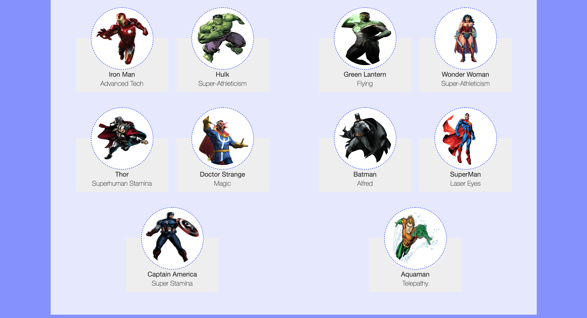

# AJAX practice pt.1

## Query an API and use the return to render content to the DOM.

In this exercise, you will be creating a static webpage that looks like the image below:

You will be able to complete this exercise using a single function. It is recommended you first build this app using just one function. 

Once you've completed the activity, think about ways you can break up the logic and take a more modular approach to the problem.

You will not need to alter prompt.html or style.css. `Proceed to app.js where you will find step-by-step instructions for this exercise.`